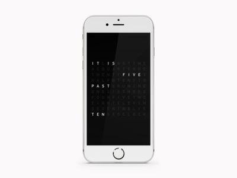

SwiftTextClock
==============

**SwiftTextClock** was written by **[Michael Teeuw](https://michaelteeuw.nl)**

## What is it?

This project is an experiment to reproduce the beautiful [QlockTwo](http://www.qlocktwo.com) as a Swift applicartion.

## How to use

Download this repository, and run the project!

## Disclaimer

This is just a quick experiment. So be gentle. ;)

## Contributing

Forks, patches and other feedback are welcome.